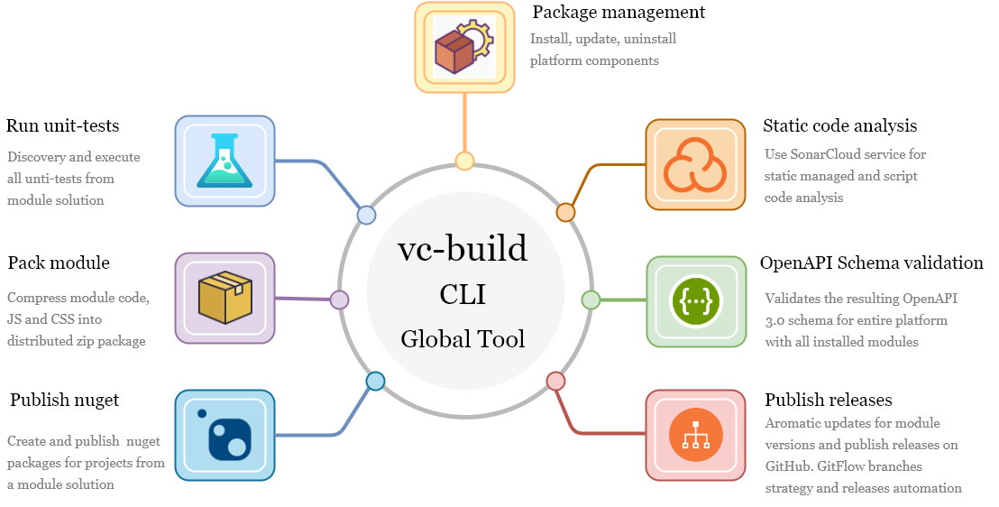

# Introduction


The VirtoCommerce Global Tool (vc-build) is the official CLI [.NET Core GlobalTool](https://docs.microsoft.com/en-us/dotnet/core/tools/global-tools) that helps you build, test and deploy releases, create and push NuGet packages, provide package management for projects based on VirtoCommerce, and automate common DevOps tasks. It is powered by [nuke.build](https://nuke.build/) - a cross-platform build automation system with C# DSL, that provides an approach to embrace existing IDE tooling and state where everyone in a team can manage and change the build scenarios. This allows writing build scenarios in C# and debugging them in Visual Studio. Also, along with cross-platform support, it was the best choice for us to build our own build automation solution on top of this project.

Check out [the project source code](https://github.com/VirtoCommerce/vc-build) for the implementation details.



## The key features:

[Build automation](docs/CLI-tools/build-automation.md) 

- build and bundle a module project (both managed and scripted parts)
- discover and run all the unit tests from the solution
- create and publish NuGet packages for projects from your solution, this can be helpful if you intend to re-use a module's logic in another project, you will be able to quickly publish the needed version as a NuGet package. In the private or public NuGet registry
- include targets that allow performing various additional quality checks such as static code analysis (currently we support out-of-the-box integration with SonarCloud)

[Packages management](docs/CLI-tools/package-management.md) 

- install, update, uninstall modules 
- install and update a platform application
- prepare backend package with specific versions of the platform and modules from the manifest file
  
[The platform cold start optimization and data migration (WIP)](docs/CLI-tools/cold-start-and-data-migration.md)

- platform start optimization (slow run on Azure case)
- get idempotent SQL scripts for all modules EF migrations with the ability to apply them in a specific order without installed platform and source code (helpful for migration from VirtoCommerce platform version 2 (latest) to version 3)

## Before you start
Before you start using `VirtoCommerce.GlobalTool`, install the following in order to use all its functionality:

- .NET SDK 5.x
- Node.js 12.x
- Git SCM

## Installation
Run this command to install `VirtoCommerce.GlobalTool` on your machine:
```console

dotnet tool install VirtoCommerce.GlobalTool  -g

```

## Updating 
Run this command to update `VirtoCommerce.GlobalTool` to the latest version:

```console

dotnet tool update VirtoCommerce.GlobalTool -g

```

## Checking installed version
To check which `VirtoCommerce.GlobalTool` tools are installed globally on your system, use the following command:

```console

dotnet tool list -g

```

## Getting started
To use `VirtoCommerce.GlobalTool` by invoke the tool run the following command: `vc-build`

To get the list of all targets:
```console

vc-build help

```
Command output:

```console
NUKE Execution Engine version 5.0.2 (Windows,.NETCoreApp,Version=v2.1)

Target with name 'help' does not exist. Available targets are:
  - ChangeVersion
  - Clean
  - ClearTemp
  - Compile
  - CompleteHotfix
  - CompleteRelease
  - Compress
  - GetManifestGit
  - GrabMigrator
  - IncrementMinor
  - IncrementPatch
  - Init
  - InitPlatform
  - Install
  - InstallModules
  - InstallPlatform
  - MassPullAndBuild
  - Pack
  - Publish
  - PublishManifestGit
  - PublishModuleManifest
  - PublishPackages
  - QuickRelease
  - Release
  - Restore
  - SonarQubeEnd
  - SonarQubeStart
  - StartAnalyzer
  - StartHotfix
  - StartRelease
  - SwaggerValidation
  - Test
  - Uninstall
  - Update
  - UpdateManifest
  - ValidateSwaggerSchema
  - WebPackBuild
```

To get help for the specific target:
```console

vc-build help NameOfTheTarget

```

## Usage examples
Below you can see how the specific target could be used

### Compress
The target is used to create a redistributed zip archive for a module or platform. After executing, the resulting zip is placed in `artifacts` folder.
To execute this target, you need to run this command in the root module folder of the cloned from GitHub repository.

```console

vc-build compress

```

Console output

```console

═══════════════════════════════════════
Target             Status      Duration
───────────────────────────────────────
Clean              Executed        0:00
Restore            Executed        0:07
Compile            Executed        0:06
WebPackBuild       Executed        0:00
Test               Executed        0:05
Publish            Executed        0:01
Compress           Executed        0:01
───────────────────────────────────────
Total                              0:23
═══════════════════════════════════════

```

### StartRelease, CompleteRelease, QuickRelease, StartHotfix, CompleteHotfix
Used to automate the routine operations with release branches
#### StartRelease:
- creates and pushes the new branch release/*version* from dev
#### CompleteRelease:
- merges release/*version* into master and pushes
- merges into dev branch, increments version's minor and pushes
#### QuickRelease: 
- triggers StartRelease and then CompleteRelease
#### StartHotfix:
- increments version's patch in master
- creates and pushes the new branch hotfix/*version*
#### CompleteHotfix:
- merges hotfix branch into master
- adds tag and pushes

### Packages management
The `vc-build` provides the set of targets that allow you to easily install, uninstall, and update platform dependencies by simple CLI commands execution.

#### Install

```console
vc-build install (with no args)
vc-build install -platform -version <version>
vc-build install -module <module> -version <version>
vc-build install -module <module>:<version>
```

This command downloads and install into the current folder the platform or modules with versions that are passed as the command parameters or defined in `vc-package.json`. 

`vc-package.json` - file is used to maintain the list of installed modules with their versions. This allows `vc-build` to easily restore the platform with the modules when on a different machine, such as a build server, without all those packages.


- `vc-build install (with no args)`

This target downloads and install into the current folder the platform and modules with versions described in `vc-package.json`. 
If `vc-package.json` is not found in the local folder, by default the command will download and install the latest platform and modules versions that are marked with the `commerce` group.

By default, `install` target will install all modules listed as dependencies in `vc-package.json`.

Examples:
```console
vc-build install 
```

- `vc-build install -platform -version <version>`

Fetch and install the platform with the specific version. If the platform with specified version does not exist in the registry, then this will fail.
If no version is specified, the latest platform version will be installed.

Examples:
```console
vc-build install -platform
vc-build install -platform -version 3.55.0
```

- `vc-build install -module -version <version>`

Install the specified version of the module. This will fail if the version has not been published to the registry.
If no version is specified, the latest module version will be installed.
You can also install multiple modules with a single command by specifying multiple modules with their versions as arguments.

If the module to be installed has dependencies, their latest versions will be installed along with it.

This command also modified the `vc-package.json` with the installed dependencies after successful command execution.

Examples:
```console
vc-build install -module VirtoCommerce.Cart
vc-build install -module VirtoCommerce.Cart -version 3.12.0
vc-build install -module VirtoCommerce.Cart:3.12.0 VirtoCommerce.Core:3.20.0
```

#### Update

```console
vc-build update (with no args)
vc-build update -platform -version <version>
vc-build update -module <module> -version <version>
```
This command will update the platform and all modules listed to the version specified by `<version>`, respecting semver.
If `<version>` is not specified the component will updated to the latest version.
If no args are specified, the platform and all modules in the specified location will be updated.

This command also updated the installed dependencies versions in the `vc-package.json` 

Examples:
```console
vc-build update
vc-build update -platform
vc-build update -platform -version 3.14.0
vc-build update -module VirtoCommerce.Cart
vc-build update -module VirtoCommerce.Cart -version 3.30.0
```

#### Uninstall
```console
vc-build uninstall -module <module>
```
This uninstalls a module and completely removes all modules that depend on it.
It also removes uninstalled modules from your `vc-package.json`.

Examples:
```console
vc-build uninstall -module VirtoCommerce.Cart
```
