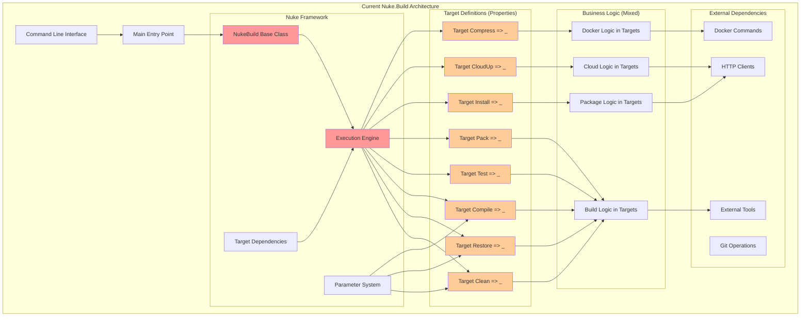
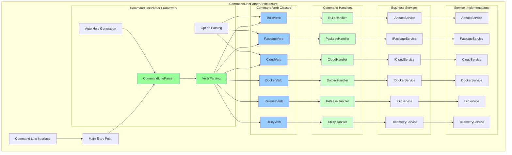

# Architecture Comparison: Nuke.Build vs CommandLineParser

## Current Nuke.Build Architecture



## Proposed CommandLineParser Architecture



## Key Architectural Differences

### Nuke.Build Characteristics

| Aspect | Nuke.Build | Description |
|--------|------------|-------------|
| **Entry Point** | `Execute<Build>(x => x.Target)` | Declarative target selection |
| **Command Definition** | Properties with `Target` delegates | Fluent API with lambda expressions |
| **Parameter Binding** | `[Parameter]` attributes | Automatic parameter injection |
| **Dependency Management** | `.DependsOn()`, `.After()`, `.Before()` | Built-in target orchestration |
| **Execution Model** | Target graph execution | Dependency-driven execution |
| **Business Logic** | Embedded in target definitions | Mixed with infrastructure code |
| **Error Handling** | Framework-managed | Limited customization |
| **Help System** | Auto-generated from targets | Basic target listing |

### CommandLineParser Characteristics

| Aspect | CommandLineParser | Description |
|--------|------------------|-------------|
| **Entry Point** | `Parser.Default.ParseArguments()` | Explicit verb/option parsing |
| **Command Definition** | Verb classes with attributes | POCO classes with decorations |
| **Parameter Binding** | `[Verb]`, `[Option]`, `[Value]` | Explicit attribute mapping |
| **Dependency Management** | Manual service injection | External DI container |
| **Execution Model** | Handler-based execution | Traditional method calls |
| **Business Logic** | Separated into services | Clean separation of concerns |
| **Error Handling** | Full control | Custom error handling |
| **Help System** | Auto-generated from attributes | Rich help text support |

## Code Examples

### Current Nuke.Build Pattern

```csharp
// Current approach - everything in one class
internal partial class Build : NukeBuild
{
 [Parameter("Configuration to build")]
    public static Configuration Configuration { get; set; } = Configuration.Debug;

    public Target Clean => _ => _
        .Before(Restore)
        .Executes(() =>
 {
    // Business logic mixed with infrastructure
  var ignorePaths = new List<AbsolutePath>();
 if (WebProject != null)
   {
            ignorePaths.Add(WebProject.Directory / "modules");
            }
  CleanSolution(cleanSearchPattern, ignorePaths.ToArray());
        });

    public Target Install => _ => _
        .Triggers(InstallPlatform, InstallModules, ValidateDependencies)
        .DependsOn(Backup)
    .Executes(async () =>
        {
            // Complex business logic embedded in target
  var packageManifest = await OpenOrCreateManifest(PackageManifestPath.ToAbsolutePath(), Edge);
            var githubModuleSources = PackageManager.GetGithubModuleManifests(packageManifest);
  // ... 50+ lines of business logic ...
        });
}
```

### Proposed CommandLineParser Pattern

```csharp
// Verb definitions - clean separation
[Verb("build", HelpText = "Build automation commands")]
public class BuildOptions
{
    [Option('c', "configuration", Default = "Debug", HelpText = "Build configuration")]
    public string Configuration { get; set; }

    [Option("clean", HelpText = "Clean build outputs")]
    public bool Clean { get; set; }

    [Option("restore", HelpText = "Restore dependencies")]
    public bool Restore { get; set; }

    [Option("compile", HelpText = "Compile solution")]
    public bool Compile { get; set; }
}

[Verb("package", HelpText = "Package management commands")]
public class PackageOptions
{
    [Option("install", HelpText = "Install packages")]
    public bool Install { get; set; }

    [Option("modules", HelpText = "Module names to install")]
 public IEnumerable<string> Modules { get; set; }

    [Option("platform", HelpText = "Install platform")]
    public bool Platform { get; set; }

    [Option("version", HelpText = "Version to install")]
    public string Version { get; set; }
}

// Handler with dependency injection
public class BuildHandler
{
    private readonly IArtifactService _artifactService;
    private readonly ITelemetryService _telemetryService;

    public BuildHandler(IArtifactService artifactService, ITelemetryService telemetryService)
    {
   _artifactService = artifactService;
        _telemetryService = telemetryService;
    }

    public async Task<int> HandleAsync(BuildOptions options)
    {
        _telemetryService.TrackEvent("Build", new { options.Configuration });

   if (options.Clean)
            await _artifactService.CleanAsync();

     if (options.Restore)
            await _artifactService.RestoreAsync();

        if (options.Compile)
     await _artifactService.CompileAsync(options.Configuration);

    return 0;
    }
}

// Main program
class Program
{
    static async Task<int> Main(string[] args)
    {
        // Set up DI container
    var services = ConfigureServices();
        
        return await Parser.Default.ParseArguments<BuildOptions, PackageOptions, CloudOptions>(args)
          .MapResult(
     (BuildOptions opts) => services.GetService<BuildHandler>().HandleAsync(opts),
   (PackageOptions opts) => services.GetService<PackageHandler>().HandleAsync(opts),
     (CloudOptions opts) => services.GetService<CloudHandler>().HandleAsync(opts),
errs => Task.FromResult(1));
    }
}
```

## Migration Complexity Comparison

### Nuke.Build → CommandLineParser Migration

| Migration Aspect | Complexity | Effort | Benefits |
|------------------|------------|--------|----------|
| **Verb Definition** | Low | 1-2 weeks | Clean command structure |
| **Parameter Mapping** | Medium | 2-3 weeks | Type-safe options |
| **Business Logic Extraction** | High | 4-6 weeks | Better separation of concerns |
| **Dependency Injection** | Medium | 2-3 weeks | Testable services |
| **Backward Compatibility** | High | 3-4 weeks | Manual command mapping |
| **Help System** | Low | 1 week | Rich help generation |
| **Testing** | Medium | 2-3 weeks | Unit testable handlers |

### Architecture Benefits Comparison

| Feature | Nuke.Build | CommandLineParser | Winner |
|---------|------------|------------------|---------|
| **Learning Curve** | Medium (DSL) | Low (Standard C#) | CommandLineParser |
| **Command Organization** | Target-based | Verb-based | CommandLineParser |
| **Business Logic Separation** | Poor | Excellent | CommandLineParser |
| **Dependency Management** | Built-in | Manual | Nuke.Build |
| **Parameter Validation** | Basic | Rich | CommandLineParser |
| **Help Generation** | Basic | Rich | CommandLineParser |
| **Testing** | Difficult | Easy | CommandLineParser |
| **Extensibility** | Framework-limited | Flexible | CommandLineParser |
| **Performance** | Good | Excellent | CommandLineParser |
| **Memory Usage** | Higher | Lower | CommandLineParser |

## Command Structure Comparison

### Current Usage (Nuke.Build)
```bash
vc-build Clean
vc-build Restore
vc-build Install -Module VirtoCommerce.Cart -Version 1.0.0
vc-build CloudUp -EnvironmentName myenv -DockerUsername user
```

### Proposed Usage (CommandLineParser)
```bash
vc-build build --clean --restore --configuration Release
vc-build package --install --modules VirtoCommerce.Cart --version 1.0.0
vc-build cloud --up --environment-name myenv --docker-username user
```

## Conclusion

**CommandLineParser** offers a more traditional and flexible approach compared to Cocona, with:

✅ **Advantages:**
- Lower learning curve (standard C# patterns)
- Excellent separation of concerns
- Rich parameter validation and help generation
- Better testability
- More control over execution flow
- Mature and stable library

❌ **Disadvantages:**
- More boilerplate code
- Manual dependency injection setup
- No built-in execution orchestration
- Requires more architectural decisions

**Recommendation:** CommandLineParser is an excellent choice if you prefer explicit control and traditional patterns over the more opinionated Cocona framework.
